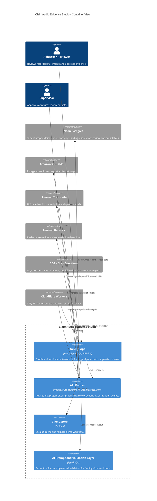

# Architecture

ClaimAudio Evidence Studio is a Next.js App Router application deployed on Cloudflare Workers through OpenNext. It supports a local sample mode, a Neon-backed pilot mode, and AWS adapter paths for uploaded audio, transcription, evidence extraction, and export storage.

## Container Diagram

## Runtime Flow

1. User signs in through pilot access-code auth.
2. Dashboard loads claim projects from `GET /api/projects`.
3. User creates a claim project.
4. Sample mode uses committed synthetic audio and mock analysis data.
5. Uploaded mode creates a Neon project, registers audio, and returns a signed S3 upload URL.
6. Processing starts through `POST /api/projects/[id]/processing`.
7. Uploaded audio path starts or polls Amazon Transcribe.
8. Transcribe output is normalized into timestamped transcript segments.
9. Bedrock evidence extraction runs through AWS adapter scaffolding and validates findings.
10. Reviewer approves, rejects, edits, clips, submits for supervisor review, and exports work product.
11. Audit events are recorded for key workflow actions.

## Deployment Shape

- Cloudflare Worker hosts Next.js pages and API routes.
- Static assets are emitted by OpenNext into `.open-next/assets`.
- Worker vars live in `wrangler.jsonc`.
- Secrets such as `DATABASE_URL`, AWS credentials, and pilot access codes live in Cloudflare Worker secrets.
- GitHub Actions builds and deploys with `npx wrangler deploy --keep-vars`.

## AWS and Service Boundaries

- `AwsStorageService`: signed S3 upload URLs.
- `AwsTranscriptionService`: Transcribe start, status polling, and transcript normalization.
- `AwsAnalysisService`: Bedrock invocation and evidence validation.
- `AwsExportArtifactService`: encrypted S3 export storage and signed downloads.
- `AwsWorkflowService`: SQS and Step Functions adapter scaffold.

The async orchestration adapter exists, but the current processing route still uses a direct route-triggered flow. Moving this behind SQS, Step Functions, retries, and DLQs is a documented next step.

## Data Flow

- Session tenant ID scopes repository access.
- Claim projects reference audio assets.
- Transcript segments, findings, contradictions, clips, exports, review actions, and audit events are stored in Neon.
- S3 object keys are stored on audio/export records when AWS storage is used.
- AI findings are rejected if they lack quote/timestamp/category/confidence/why-it-matters support.

## Auth Flow

- `/login` posts to `/api/auth/session`.
- Server validates an access code and assigns a role.
- Session token is signed and stored in an HTTP-only cookie.
- API routes call `requireAuth` and optional role sets.
- Roles include adjuster, supervisor, SIU, defense paralegal, defense attorney, and admin.

This is pilot auth. Production should use Cognito/Auth0 JWT validation and customer tenant membership.

## CI/CD Flow

1. Push to `main` or manual workflow dispatch.
2. `npm ci`.
3. `npm run typecheck`.
4. `npm run test:guardrails`.
5. Validate Cloudflare deploy secrets.
6. `npm run cf:build`.
7. `npx wrangler deploy --keep-vars`.

## Key Constraints

- No real claim data is committed.
- Local demo must run without AWS keys.
- Real upload is gated until Neon, AWS, signed auth, and tenant scope are configured.
- No claims are made about production usage, compliance certification, or customer deployment.
